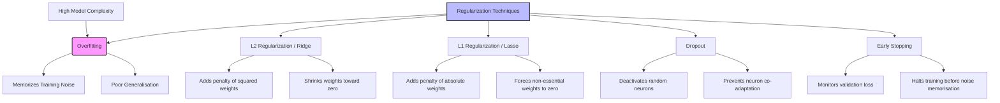

Regression is one of the most fundamental and widely used types of supervised learning in machine learning. While classification tasks focus on assigning labels to data points (e.g., "Spam" vs. "Not Spam"), regression focuses on predicting a **continuous numerical value**.

Whether you are forecasting stock prices, estimating house values, or predicting temperature changes, regression provides the mathematical framework to map input features to a quantitative output.

:::callout
**Key Takeaway:** Regression models aim to find a function $f(x)$ that minimizes the difference between the predicted output $\hat{y}$ and the actual target $y$.
:::

## 1. Fundamental Concepts and Mathematical Foundations

The heart of regression lies in the "Line of Best Fit." For Linear Regression, we assume a linear relationship between the independent variables (features) and the dependent variable (target).

## The Linear Equation

For a single feature:
$$y = \beta_0 + \beta_1x + \epsilon$$

Where:

- $y$: Predicted value.

- $\beta_0$: Intercept (value of $y$ when $x=0$).

- $\beta_1$: Coefficient/Slope (weight assigned to feature $x$).

- $\epsilon$: Error term (noise).

## Loss Function: Mean Squared Error (MSE)

To optimize the coefficients ($\beta$), we need a way to measure "wrongness." MSE is the standard loss function for regression.

$$MSE = \frac{1}{n} \sum_{i=1}^{n} (y_i - \hat{y}_i)^2$$

:::mermaid
graph TD
    A[Input Data] --> B[Feature Extraction]
    B --> C[Model Prediction $\hat{y}$]
    C --> D{Calculate Loss}
    D --> E[MSE / MAE]
    E --> F[Gradient Descent Optimization]
    F -->|Update Weights| C
:::

## 2. Types of Regression Models

Depending on the complexity of the data, different models are employed:

| Model Type | Best Use Case | Characteristics |
| :--- | :--- | :--- |
| **Simple Linear** | Single variable relationship (e.g., height vs. weight). | Easy to interpret, prone to underfitting. |
| **Multiple Linear** | Multiple inputs (e.g., house price based on area, rooms, age). | Can handle complex feature sets. |
| **Polynomial** | Non-linear relationships (e.g., growth curves). | Captures curves but risks overfitting. |
| **Ridge Regression** | High multicollinearity (features correlated). | Uses L2 regularization to penalize large weights. |
| **Lasso Regression** | Feature selection needed. | Uses L1 regularization to shrink some weights to zero. |

## 3. Addressing Overfitting: Regularization

When a model becomes too complex, it begins to "memorize" noise in the training data rather than learning the underlying pattern. This is known as **overfitting**. We combat this using Regularization.




## 4. Implementation in Python

The following example demonstrates a Multiple Linear Regression model using `scikit-learn` to predict house prices.

```python
import numpy as np
import pandas as pd
from sklearn.model_selection import train_test_split
from sklearn.linear_model import LinearRegression
from sklearn.metrics import mean_squared_error, r2_score

# Sample Dataset: [Square Footage, Number of Bedrooms]
data = {
    'SqFt': [1500, 2000, 2400, 3000, 3500, 4000, 4500, 5000],
    'Bedrooms': [3, 3, 4, 4, 5, 5, 6, 6],
    'Price': [300000, 400000, 480000, 600000, 700000, 820000, 900000, 1050000]
}

df = pd.DataFrame(data)

# Feature Selection
X = df[['SqFt', 'Bedrooms']]
y = df['Price']

# Split Data (80% Train, 20% Test)
X_train, X_test, y_train, y_test = train_test_split(X, y, test_size=0.2, random_state=42)

# Initialize and Train Model
model = LinearRegression()
model.fit(X_train, y_train)

# Make Predictions
predictions = model.predict(X_test)

# Evaluate model
mse = mean_squared_error(y_test, predictions)
r2 = r2_score(y_test, predictions)

print(f"Mean Squared Error: {mse:.2f}")
print(f"R-Squared Score: {r2:.4f}")
print(f"Coefficients: {model.coef_}")
```

## 5. Evaluation Metrics

To determine if your regression model is performing well, you must look beyond simple accuracy. Use these metrics:

1. **Mean Absolute Error (MAE):** The average of the absolute differences between prediction and actual. It is easily interpretable in the same units as the target.

2. **Root Mean Squared Error (RMSE):** The square root of MSE. It penalizes large errors more heavily than MAE.

3. **R-Squared ($R^2$):** Represents the proportion of variance for the dependent variable that's explained by the independent variables. An $R^2$ of 1.0 is a perfect fit.

:::callout
**Pro Tip:** Always check your residuals (the difference between actual and predicted values). Residuals should ideally be randomly distributed around zero. If you see a pattern, your model may be missing a non-linear relationship.
:::

## 6. Real-World Use Cases

- **Finance:** Predicting stock market trends or identifying the risk level of a loan based on credit history.

- **Real Estate:** Estimating property values based on location, size, and local amenities.

- **Retail:** Forecasting future sales volumes to optimize inventory management.

- **Healthcare:** Estimating patient recovery times or predicting blood pressure levels based on lifestyle factors.