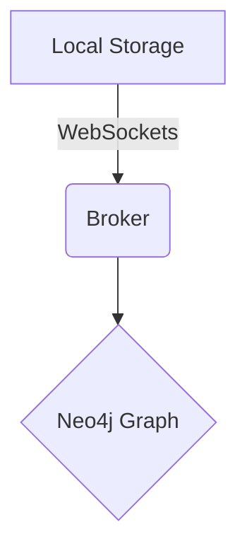

# sasas

:::whiteboard
[{"id":"shp-1783518374046","type":"circle","x":134,"y":86.5,"width":211,"height":106,"color":"#ffffff","thickness":3},{"id":"shp-1783518374690","type":"circle","x":401,"y":171.5,"width":160,"height":91,"color":"#ffffff","thickness":3},{"id":"shp-1783518378186","type":"rect","x":265,"y":69.5,"width":191,"height":141,"color":"#10b981","thickness":3}]
:::




> sadfasdf asdfasdf

```bash
// Calculate formula output
const result = [10, 20, 30].reduce((a, b) => a + b, 0);
console.log("Reduced Result:", result);
```

:::decision
Status: Rejected
Owner: @asdfa
Date: 
Impact: Critical
References: asdgasdg

State the decision in one sentence.
:::


