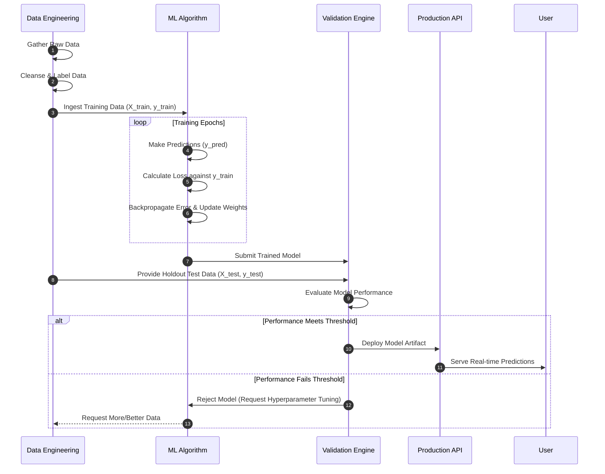
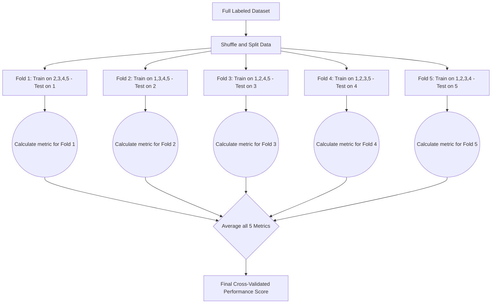

## 1. Introduction and Theoretical Foundations

Supervised learning is the most dominant and widely utilized paradigm within the broader field of artificial intelligence and machine learning. At its core, this approach relies on the use of heavily annotated, labeled datasets to train algorithms how to classify data or predict outcomes accurately. The term "supervised" stems from the analogy of a student learning under the strict guidance of a teacher. The dataset acts as the teacher, providing the algorithm with both the exact questions (input features, often denoted mathematically as $X$) and the correct answers (the target labels, denoted as $y$). Through an iterative process of mathematical optimization, the algorithm generates predictions, compares its predictions against the known correct answers, calculates the margin of error using a specific loss function, and subsequently updates its internal parameters to minimize this error. Over thousands or millions of iterations, the model uncovers the complex, often non-linear mathematical mapping functions that dictate the relationship between the inputs and outputs, ultimately acquiring the ability to generalize this logic to entirely new, unseen data points.


The reliance on labeled data is both the greatest strength and the primary limitation of supervised learning. Because the ground truth is known during training, the performance of the model can be objectively and rigorously quantified using specific statistical metrics. This allows engineers to confidently deploy these models into high-stakes environments, such as medical diagnostics, autonomous vehicle navigation systems, and real-time financial fraud detection networks. However, the acquisition of this labeled data is notoriously resource-intensive. Human annotators must often manually label thousands of images, transcribe hours of audio, or categorize vast amounts of text—a process that is expensive, slow, and susceptible to human bias and error.

## 2. The Machine Learning Lifecycle: A Sequence Analysis

Developing a supervised learning system is not merely about writing a mathematical algorithm; it is a comprehensive software and data engineering lifecycle. The sequence diagram below illustrates the complex interactions between the Data Engineering team, the Machine Learning Model, the Validation system, and the final Production Environment.



## 3. Core Categories and Algorithm Selection

Supervised learning problems are strictly bifurcated into two main categories based on the data type of the target variable.

## Classification vs. Regression

- **Classification:** The algorithm's objective is to assign input data into discrete categories or classes. The output is categorical. If there are only two categories (e.g., Spam or Not Spam), it is called Binary Classification. If there are more than two (e.g., classifying images of cats, dogs, and birds), it is Multi-class Classification.

- **Regression:** The algorithm's objective is to predict a continuous numerical output. The output is an infinite range of real numbers. Examples include predicting the exact temperature of a city tomorrow, the future price of a specific stock, or the lifespan of a mechanical component.

## Algorithm Comparison Table

Choosing the right algorithm is a delicate balance of understanding your dataset's size, its complexity, and your need for model interpretability.

| Algorithm Family | Primary Use Case | Pros | Cons |
| --- | --- | --- | --- |
| **Linear Models** (Linear/Logistic Regression) | Simple regression and binary classification. | Highly interpretable, fast to train, less prone to overfitting on simple data. | Cannot capture complex, non-linear relationships. Assumes feature independence. |
| **Support Vector Machines (SVM)** | Complex classification with clear margins of separation. | Effective in high-dimensional spaces; memory efficient. | Extremely slow to train on large datasets; highly sensitive to noise and outliers. |
| **Decision Trees & Ensembles** (Random Forest, XGBoost) | Tabular data with mixed feature types (categorical/numerical). | Handles non-linear data well; robust to outliers; requires minimal data scaling. | Single trees easily overfit. Ensembles can become "black boxes" lacking interpretability. |
| **Neural Networks** (Deep Learning) | Image recognition, Natural Language Processing, complex pattern matching. | Unparalleled performance on massive, complex, unstructured datasets. | Requires massive amounts of data and compute (GPUs); completely uninterpretable ("black box"). |

## 4. Advanced Concepts: The Bias-Variance Tradeoff

One of the most critical challenges in supervised learning is navigating the Bias-Variance Tradeoff, which directly relates to a model's ability to generalize.

- **High Bias (Underfitting):** Occurs when an algorithm makes very strong, simplistic assumptions about the data. The model is too rigid to capture the underlying patterns, resulting in poor performance on both the training and testing data. A linear regression model attempting to fit a highly curved dataset is a classic example of high bias.

- **High Variance (Overfitting):** Occurs when an algorithm is excessively complex and "memorizes" the noise and random fluctuations in the training data rather than the actual signal. While it will achieve near-perfect accuracy on the training data, it will fail catastrophically when exposed to new, unseen testing data.

- **The Optimal Sweet Spot:** The goal of the machine learning engineer is to find the perfect equilibrium—a model complex enough to capture the true underlying patterns (low bias) but constrained enough to ignore the random noise (low variance).


To ensure a model is generalizing well and not just overfitting, engineers use a technique called **K-Fold Cross-Validation**, illustrated in the flowchart below.



## 5. Model Evaluation Metrics

You cannot improve what you cannot measure. Depending on the business context, different metrics are prioritized.

| Metric | Definition | When to Prioritize | Formula / Concept |
| --- | --- | --- | --- |
| **Accuracy** | The ratio of correctly predicted observations to total observations. | When the dataset classes are perfectly balanced. | $(TP + TN) / Total$ |
| **Precision** | The ratio of correctly predicted positive observations to total predicted positives. | When the cost of a False Positive is very high (e.g., spam filter). | $TP / (TP + FP)$ |
| **Recall (Sensitivity)** | The ratio of correctly predicted positive observations to all actual positives. | When the cost of a False Negative is catastrophic (e.g., cancer detection). | $TP / (TP + FN)$ |
| **F1-Score** | The weighted harmonic mean of Precision and Recall. | When you have heavily imbalanced datasets and need a balance of both metrics. | $2 \times \frac{Precision \times Recall}{Precision + Recall}$ |

## 6. Comprehensive Implementation Code

The following Python code block demonstrates a complete, production-ready supervised learning pipeline. It goes far beyond simply training a model; it includes data standardizing, pipeline creation, K-Fold cross-validation, and hyperparameter tuning using Grid Search—which are essential steps in real-world applications.

```python
import pandas as pd
from sklearn.datasets import load_wine
from sklearn.model_selection import train_test_split, GridSearchCV
from sklearn.preprocessing import StandardScaler
from sklearn.ensemble import RandomForestClassifier
from sklearn.pipeline import Pipeline
from sklearn.metrics import classification_report, confusion_matrix
import seaborn as sns
import matplotlib.pyplot as plt

def build_supervised_pipeline():
    """
    Constructs, trains, and evaluates an end-to-end supervised learning pipeline.
    Utilizes a Random Forest Classifier on the Wine quality dataset.
    """
    
    # 1. Data Ingestion
    print("Loading dataset...")
    wine_data = load_wine()
    X = pd.DataFrame(wine_data.data, columns=wine_data.feature_names)
    y = wine_data.target

    # 2. Train/Test Split (stratified to maintain class distributions)
    X_train, X_test, y_train, y_test = train_test_split(
        X, y, test_size=0.25, random_state=42, stratify=y
    )

    # 3. Define the Machine Learning Pipeline
    # Pipelines prevent data leakage between training and testing sets during scaling
    pipeline = Pipeline([
        ('scaler', StandardScaler()), # Standardize features by removing mean and scaling to unit variance
        ('classifier', RandomForestClassifier(random_state=42)) # The chosen algorithm
    ])

    # 4. Define Hyperparameter Grid for Tuning
    # We test multiple configurations to find the absolute best model
    param_grid = {
        'classifier__n_estimators': [50, 100, 200],
        'classifier__max_depth': [None, 5, 10],
        'classifier__min_samples_split': [2, 5]
    }

    # 5. Initialize Grid Search with 5-Fold Cross Validation
    print("Beginning Hyperparameter Tuning via GridSearch CV...")
    grid_search = GridSearchCV(
        estimator=pipeline,
        param_grid=param_grid,
        cv=5,               # 5-fold cross-validation
        n_jobs=-1,          # Use all available CPU cores
        scoring='f1_macro', # Optimize for F1-score due to multi-class nature
        verbose=1
    )

    # 6. Train the Model (This fits the model across all combinations of parameters)
    grid_search.fit(X_train, y_train)

    print(f"\nBest Hyperparameters found: {grid_search.best_params_}")
    
    # 7. Extract the best model from the grid search
    best_model = grid_search.best_estimator_

    # 8. Final Evaluation on Holdout Test Set
    print("\nEvaluating best model on unseen test data...")
    predictions = best_model.predict(X_test)
    
    print("\n--- Detailed Classification Report ---")
    print(classification_report(y_test, predictions, target_names=wine_data.target_names))
    
    # 9. Generate Confusion Matrix data
    cm = confusion_matrix(y_test, predictions)
    print("\n--- Confusion Matrix ---")
    print(cm)
    
    return best_model

if __name__ == "__main__":
    # Execute the pipeline
    trained_model = build_supervised_pipeline()

```