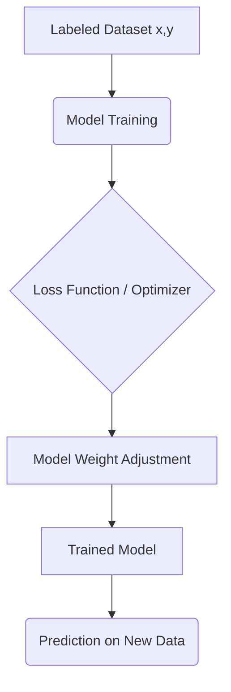

Supervised machine learning represents a foundational paradigm in AI, characterized by training models on labeled datasets. Unlike unsupervised methods, which seek inherent patterns, supervised learning requires input features ($X$) paired with corresponding true output labels ($Y$). The primary goal is for the model to learn a mapping function, $f(X) \to Y$, such that given new, unseen data, it can accurately predict the target variable. This process fundamentally involves defining a loss function that quantifies the divergence between the predicted output and the true label, guiding iterative optimization via algorithms like gradient descent.

This learning process can be broadly categorized into two types: classification (predicting discrete labels) and regression (predicting continuous values). A core element of its implementation is the rigorous evaluation against a held-out test set to prevent overfitting. The relationship between data, model training, and evaluation can be visualized using a flowchart:



## Implementation Workflow and Key Components

To effectively implement a supervised model, several critical steps must be followed, from data preprocessing to hyperparameter tuning.

- Data Preparation: Handling missing values, feature scaling (e.g., standardization or normalization), and encoding categorical variables.

- Model Selection: Choosing an appropriate algorithm (e.g., Linear Regression for continuous targets, or Support Vector Machines for complex boundaries).

- Training/Validation Split: Ensuring adequate data partitioning to accurately assess model generalization capabilities.

The following table summarizes common approaches and their primary use cases:

| Task Type | Example Algorithm | Output Data Type | Primary Use Case |
| :--- | :--- | :--- | :--- |
| Classification | Logistic Regression, Random Forest | Discrete Label (e.g., 0 or 1) | Determining spam or not-spam |
| Regression | Ridge Regression, XGBoost | Continuous Value (e.g., 3.14) | Predicting housing prices |

## Advanced Considerations: Model Validation

When moving beyond basic models, understanding the inherent biases in model evaluation is paramount. The concept of data leakage—where information from the test set inadvertently influences the training process—must be rigorously mitigated.

> **Best Practice Warning:** Always employ k-fold cross-validation when assessing performance metrics. This technique ensures that every data point gets to be part of the validation set exactly once, providing a much more robust estimate of the model's generalizability than a single train/test split.

Furthermore, the performance of various algorithms can be quantified using specific metrics tailored to the problem domain. For binary classification, accuracy is often supplemented by the F1-Score, which balances precision and recall, thereby offering a holistic view of the model's predictive equilibrium.

The complexity trade-off between feature dimensionality and model capacity is key. A high-dimensional space may require dimensionality reduction techniques like Principal Component Analysis (PCA) prior to model training.

```python
# Example pseudo-code for calculating F1 Score
def calculate_f1(true_positives, false_positives, false_negatives):
    # Calculate Precision: TP / (TP + FP)
    # Calculate Recall: TP / (TP + FN)
    # F1 = 2 * (Precision * Recall) / (Precision + Recall)
    pass
```

A systematic deployment checklist should include verifying:

- Feature importance mapping.

- Computational efficiency (runtime complexity, $O(N)$).

- Interpretability required by stakeholders.